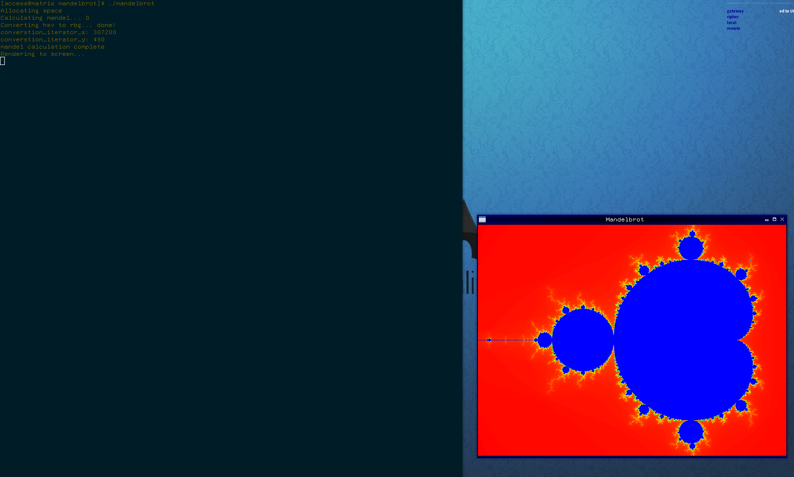

This is a version of the mandelbrot set implementation from rosettacode.com 

You can find the original under C -> Interactive PPM

So far this is a simple illustration of understanding OpenGL and GLFW, however updates need to be made namely moving from LegacyGL to ModernGL

